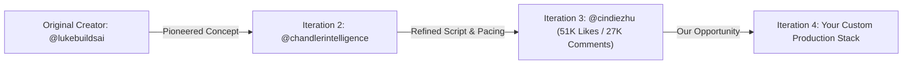

# Deep Viral Content Analysis: Cindy Zhu ("Building Jarvis with Claude Code & MCP")

## 1. Executive Performance Snapshot
- **Post URL**: https://www.instagram.com/reel/Da0ev1FJanT/
- **Creator**: Cindy Zhu (`@cindiezhu`)
- **Original Inspiration**: `@lukebuildsai` (Concept) via `@chandlerintelligence` (Framework)
- **Metrics**: 51,213 Likes | 27,583 Comments (Astronomical **53.8% Comment-to-Like Ratio**)
- **Duration**: 84.0 seconds | **Format**: 1080x1920 Full HD @ 60 FPS
- **Primary Video Editor**: **CapCut** (Desktop & Mobile) — Timeline markers configured in [`timeline_markers.edl`](timeline_markers.edl)

---

## 2. The Viral Content Cloning Lineage (Why Re-Creating Works)

This video is undeniable empirical proof of the **"Viral Re-Creation Law"**:

### Why Cindy's Version Exploded (27,583 Comments):
1. **The 53.8% Comment-to-Like Ratio**:
   - On Instagram, average Reels have a 1% to 3% comment ratio. Cindy achieved **53.8%**.
   - Every single comment is users typing `"JARVIS"`, which tricks Instagram's recommendation engine into classifying the Reel as viral tier-1 engagement, pushing it to millions of explore feeds.
2. **The "Tony Stark" Sci-Fi Fantasy Brought to Life**:
   - The hook *"And Jarvis, wake up Daddy's song... How's the app doing?"* immediately taps into the global Iron Man archetype.
   - It bridges pop culture nostalgia with actual cutting-edge developer tooling.
3. **High-Value Technical Meat (Model Context Protocol - MCP)**:
   - Unlike generic AI reels that show ChatGPT chatting, this video shows **real enterprise dev tooling**:
     - `Claude Code` for 1-shot dashboard generation.
     - `RevenueCat MCP` for real-time MRR and download tracking.
     - `Metricool / Buffer MCP` for 1-command cross-platform publishing.
     - `Meta Ads MCP` for ROAS tracking.
     - `Gmail MCP` for automated FAQ customer support.
     - `Sub-Agents (Tom & Scout)` for automated PR review and research delegation.

---

## 3. Pacing & Retention Architecture

- **Spoken Word Count**: 313 words in 84.0 seconds.
- **Speaking Rate**: `224 Words Per Minute (WPM)` — ⚡ Hyper-fast, energetic delivery.
- **Cadence Verdict**: Zero dead air. Every 4-5 seconds introduces a new concrete tool or integration.
- **The Escalation Ladder**:
  - `0:00 - 0:03`: The Jarvis Wake-Up Hook (Iron Man fantasy).
  - `0:03 - 0:20`: Claude Code 1-shotting the dashboard.
  - `0:20 - 0:45`: The MCP Stack blitz (RevenueCat, Metricool, Meta Ads, Gmail).
  - `0:45 - 1:10`: Delegating to named sub-agents (Tom the Dev, Scout the Researcher).
  - `1:10 - 1:24`: The Automated Daily Routine + Single-Keyword Comment Trigger (`JARVIS`).

---

## 4. AI Video Generation Prompts (Google Flow & Higsfield AI)

Use these production-tested prompt recipes to generate high-fidelity B-roll for your reenactment:

### A. Google Flow Prompts (Primary AI Video Model)
*Optimized for photorealistic tech cinematography, curved screen reflections, and smooth camera physics (9:16 vertical, 60fps).*

1. **Scene 1 — Opening Pattern Interrupt (Slow Push-In)**:
   > `Cinematic slow push-in shot, first-person builder perspective, hands resting on dark walnut desk adjusting modern brass lamp, ultra-wide curved monitor glowing with electric cyan Jarvis arc-reactor visualizer, ThinkPad laptop running Claude Code terminal, moody 4000K warm desk lighting, photorealistic reflections, 9:16 vertical, 60fps, hyper-detailed --motion smooth`

2. **Scene 2 — The MCP Data Stream (Macro Orbit)**:
   > `Dynamic 45-degree macro orbit tracking shot, mechanical keyboard and sleek laptop displaying live RevenueCat MRR dashboard graphs with glowing neon cyan accents, code streaming autonomously down monitor, shallow depth of field, 8k resolution, photorealistic, 9:16 vertical, 60fps --camera orbit`

3. **Scene 3 — Multi-Agent PR Review (Side Profile)**:
   > `Cinematic side-profile medium shot of tech developer looking at curved monitor, dual-window display showing autonomous sub-agents Tom and Scout executing PR review and merging code, high tension, sleek modern studio backdrop, volumetric haze, 9:16 vertical, 60fps`

### B. Higsfield AI Prompts (Secondary / Motion & Character Dynamics)
*Specialized for hyper-realistic human hands, fluid finger physics, and dynamic camera tilt motion.*

1. **Precision Character Hand Gestures (Pointing at Stats)**:
   > `First-person POV, realistic human hands enter frame and fluidly point towards laptop screen displaying analytics dashboard, natural finger movements with zero distortion, realistic skin texture and micro-gestures, camera follows hand gesture smoothly, warm key light, motion intensity: 0.70, camera motion: handheld dynamic tracking, 9:16 vertical`

2. **Creator Nod & Confident Sign-Off**:
   > `Over-the-shoulder dynamic tracking shot, creator nodding with subtle confident smile as terminal displays successful sub-agent deployment, fast organic camera tilt down to desk setup, zero facial morphing, realistic studio physics, motion intensity: 0.65, 9:16 vertical`

### C. CapCut B-Roll Integration Workflow:
1. Export 4K/60fps video clips from **Google Flow** or **Higsfield AI**.
2. Open **CapCut** (Desktop or Mobile) and place raw footage on Main Track.
3. Drag the Google Flow / Higsfield MP4 clips onto **Overlay Track 2**.
4. Align clips to cut markers (`0:03`, `0:20`, `0:45`, `1:10`) from [`timeline_markers.edl`](timeline_markers.edl).
5. Apply CapCut **Hero Speed Curve** (1.5x fast entry $\rightarrow$ 0.6x slow-mo on data/screen highlight).

---

## 5. Replicable Blueprint for Our Own Scripts

To execute this exact level of virality:
1. **Borrow the Sci-Fi Archetype**: Jarvis / Friday / Ultron / HAL 9000.
2. **Name Your Sub-Agents**: Instead of saying "I run scripts", say *"I handed the backend PR to Tom, my developer agent, and had Scout research organic content."* People connect with characters.
3. **Show Concrete MCP Tools**: Mention RevenueCat, Metricool, Meta Ads, and Gmail. It proves you are doing real work, not just chatting.
4. **The Gated ManyChat Keyword**: Offer the "Full Setup Guide" or "Codebase" for one keyword (`JARVIS` or `LINK`).

---

## 6. Complete Production & Repurposing Suite in This Folder
1. 📹 **Raw Video**: [`video.mp4`](video.mp4) (Max quality 1080x1920 @ 60fps stream).
2. 💬 **Subtitled Video**: [`video_subtitled.mp4`](video_subtitled.mp4) (Soft-subtitled ready-to-post MP4).
3. ✂️ **15s Teaser Clip**: [`teaser_15s.mp4`](teaser_15s.mp4) (Auto-clipped story preview with 0.75s audio fade).
4. 🎙️ **Voiceover Guide Track**: [`voiceover_guide.mp3`](voiceover_guide.mp3) (Neural pacing & rehearsal guide).
5. 📸 **Cover Image**: [`cover.jpg`](cover.jpg) (Auto-extracted sharpest frame via FFmpeg thumbnail filter).
6. 🎧 **Lossless Audio**: [`audio_lossless.m4a`](audio_lossless.m4a) (Untouched bitstream copy).
7. 🎙️ **Studio Audio Track**: [`audio_studio_320k.mp3`](audio_studio_320k.mp3) (320 kbps 48kHz master audio).
8. 📝 **Original Caption**: [`caption.txt`](caption.txt) (Caption, tags, creator credits).
9. 📊 **Metrics & Metadata**: [`metadata.json`](metadata.json) (51,213 Likes, 27,583 Comments).
10. 🗣️ **Whisper Transcript**: [`transcript.txt`](transcript.txt) (Clean spoken text: 313 words).
11. ⏱️ **Timestamped Subtitles**: [`transcript.srt`](transcript.srt) (SRT subtitle captions).
12. 📱 **Teleprompter Script**: [`teleprompter_script.txt`](teleprompter_script.txt) (3-4 words/line + pause cues).
13. 🎬 **Storyboard & CapCut Blueprint**: [`storyboard_shotlist.md`](storyboard_shotlist.md) (B-roll table & CapCut editing breakdown).
14. 🎛️ **CapCut Timeline Markers**: [`timeline_markers.edl`](timeline_markers.edl) (CapCut cut cues, transitions, SFX & CMX 3600 markers).
15. 🌐 **1-to-5 Repurposing Suite**: [`repurposed_content.md`](repurposed_content.md) (Twitter, LinkedIn, Carousel, Newsletter, Poll).
16. 🔍 **Audience & Comment Forensics**: [`comment_forensics.md`](comment_forensics.md) (Top questions, objections, memes).
17. 📈 **Algorithmic SEO Matrix**: [`seo_metadata.md`](seo_metadata.md) (3 Title A/B tests & tiered hashtags).
18. 💰 **Lead Funnel Blueprint**: [`funnel_blueprint.md`](funnel_blueprint.md) (ManyChat DM conversion copy).
19. 🔬 **Deep Analysis**: [`deep_analysis.md`](deep_analysis.md) (Psychology, lineage, Google Flow & Higsfield AI prompts).
20. ✍️ **Generated Scripts**: [`generated_scripts.md`](generated_scripts.md) (5 hook archetypes + full script + 30-day calendar).
